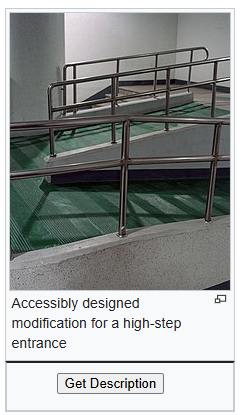
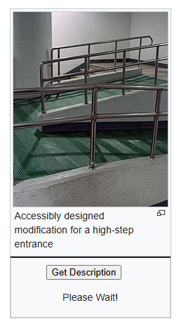
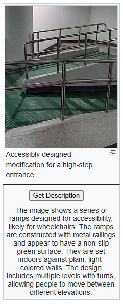

# AI Image Describer / Accessibility Tool Google Chrome Extension
A Google Chrome extension that provides AI generated desciptions for images on a webpage.

## Objective
The purpose of this Google Chrome extension is to help visually impaired individuals better understand images on web pages.

With the help of ChatGPT, descriptions are provided for images upon request.

With the combination of text readers, a visually impaired user is able to experience images on a deeper level compared to HTML default descriptions of images.

## ChatGPT Usage
Upon request of a description, a image src is sent via API call to the OpenAI Platform. There vision models are used to analyze the image and a chat prompt is sent to request a description for a visually impaired user.

## How to Install and Run the Project
1. Clone the repo onto your machine
2. Sign up and generate a API key for the OpenAI platform
    - For OpenAI, you can use the following webpage - https://platform.openai.com/docs/api-reference/authentication
3. Insert the api key into respective varibles in scripts/content.js (line 3)
4. Save the repo and open Google Chrome
5. You need to unpack the repo directory inorder to execute the chrome extension, you can follow the following section in this guide - https://developer.chrome.com/docs/extensions/mv3/getstarted/development-basics/#load-unpacked
6. Once you unpack the repo, you can now freely use the extension. Head over to a wikipedia (currently the only supported website) where you can now use the button underneath a image to generate descriptions

## How to Use the Project
1. Head over to a wikipedia webpage (For example - https://en.wikipedia.org/wiki/Accessibility)

2. Locate a image and press the "Get Description" button

3. Wait for the extension to generate the descriptions

4. After a little bit of a wait, the description will be under the "Get Description" button

## Limitations

### Limited Websites Usage
Currently, the google chrome extension only works effectively on wikipedia articles since different webpages structure their HTML image elements differently.

### Inaccurate ChatGPT descriptions
Sometimes ChatGPT will give inaccurate descriptions due to hallucinations and general misunderstanding from the vision model.

## Possible Improvements
- Increase website availability taking into account for all HTML structures
- Improve description reliability by case testing over many different examples and fine tuning
- Improve description ethical concerns by ensuring reliable descriptions with no malicious content
- Introduce a user sign-in to give differenet tier users more API calls
- Introduce different description types for differently visually impaired users
- Introduce vaired vision models for descriptions generation to reduce the insue of hallucinations and improve reliability
- Introduce descriptions storage for users who wish to go back to previously saved text
- Introduce image download and encoding to avoid website overflooding measures that prevents automated scraping of image url sources

## Current Improvements
- With the introduction of image input to the OpenAI API, there is no longer the need for the Google Vision API. Instead all computer vision is performed by the OpenAI platform